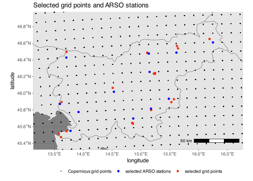

CIT-HCI-gridpoints
================

We need the coordinates of the model’s grid (near the locations we are
interested in) to extract data from netcdf files.

## Importing libraries and data

Import libraries and source functions from `processing/common.R`:

``` r
source("common.R", local = knitr::knit_global())
```

    ## 
    ## Attaching package: 'dplyr'

    ## The following objects are masked from 'package:stats':
    ## 
    ##     filter, lag

    ## The following objects are masked from 'package:base':
    ## 
    ##     intersect, setdiff, setequal, union

``` r
library(ggplot2)
library(sf)
```

    ## Linking to GEOS 3.10.2, GDAL 3.4.2, PROJ 8.2.1; sf_use_s2() is TRUE

``` r
library(rnaturalearth)
library(ggspatial)
```

Load country shape data for maps:

``` r
mapdata <- ne_load(scale = 10, type = 'countries', category = 'cultural', returnclass = "sf", destdir = "geodata")
```

    ## OGR data source with driver: ESRI Shapefile 
    ## Source: "/Users/rokuk/Documents/Work/BFUL/turizem-klima-projekcije-2022/R/geodata", layer: "ne_10m_admin_0_countries"
    ## with 258 features
    ## It has 161 fields
    ## Integer64 fields read as strings:  NE_ID

``` r
# map data can be redownloaded to the geodata folder using:
# mapdata <- ne_download(scale = 10, type = 'countries', category = 'cultural', returnclass = "sf", destdir = "geodata")
```

Read one file to get the model’s grid:

``` r
netcdfdata <- readcdf("../data/CIT/RCP4.5/mean/C3S422Lot2TEC_day-fair-cit-month-proj_mean_monthly_2021_2040_v1.nc", "day-fair-cit-month-proj")
grid <- transform_coords(netcdfdata)
```

Plot june data centered on Slovenia, to check if we have selected the
right rlon, rlat range:

``` r
image(netcdfdata$rlon, netcdfdata$rlat, netcdfdata$data[,,6])
```

<!-- -->

## Selected points

Plot map and a part of the model’s grid:

``` r
ggplot(mapdata) +
    geom_sf() +
    coord_sf(xlim=c(7, 21), ylim=c(42, 50)) + 
    geom_point(data=grid, mapping = aes(lon, lat), size=0.2) +
    xlab("longitude") +
    ylab("latitude") +
    theme_dark()
```

<!-- -->

Import coordinates of the stations we are interested in:

``` r
stationcoords <- read.csv("../data/stations.csv")
print(stationcoords)
```

    ##                            station      lat      lon
    ## 1               Ljubljana-Bežigrad 46.06556 14.51250
    ## 2                  Maribor - Tabor 46.53944 15.64500
    ## 3         Maribor - Vrbanski plato 46.56780 15.62600
    ## 4        Celje - Levec - letališče 46.23300 15.24520
    ## 5                            Celje 46.24440 15.24770
    ## 6                   Celje - Medlog 46.23660 15.22590
    ## 7          Murska Sobota - Rakičan 46.65222 16.19139
    ## 8                           Rateče 46.49694 13.71278
    ## 9                            Koper 45.54440 13.71200
    ## 10            Portorož - Beli Križ 45.52030 13.57610
    ## 11            Portorož - letališče 45.47530 13.61600
    ## 12                           Bilje 45.89556 13.62444
    ## 13          Novo mesto - Gotna vas 45.79970 15.17850
    ## 14                      Novo mesto 45.80180 15.17730
    ## 15        Šmartno pri Slov. Gradcu 46.48300 15.11190
    ## 16      Šmartno pri Slovenj Gradcu 46.48960 15.11120
    ## 17 Cerklje ob Krki - Gornji Lenart 45.92890 15.57320
    ## 18     Cerklje ob Krki - letališče 45.89430 15.52870
    ## 19                       Kočevje 1 45.63620 14.86030
    ## 20                       Kočevje 2 45.63740 14.86400
    ## 21                       Kočevje 3 45.64600 14.85010

We chose stations near major tourist areas based on the availability of
station data. In some areas multiple stations are used to represent the
same location due to missing data at some stations. We manually choose
points on the model grid near the stations. The chosen points:

``` r
names <- c("Rateče", "Bilje", "Koper", "Ljubljana", "Kočevje", "Cerklje ob Krki", "Novo mesto", "Celje", "Slovenj Gradec", "Maribor", "Murska Sobota")
gridpoint_indexes <- c(706, 661, 698, 902, 979, 1141, 1060, 1064, 1066, 1186, 1347) # these values should be the same as in the file common.R

chosen_gridpoints <- data.frame(
    lon = grid %>% filter(grid$id %in% gridpoint_indexes & grid$month == "jan") %>% pull(lon),
    lat = grid %>% filter(grid$id %in% gridpoint_indexes & grid$month == "jan") %>% pull(lat)
)

print(chosen_gridpoints)
```

    ##         lon      lat
    ## 1  13.59662 45.87349
    ## 2  13.78092 45.55046
    ## 3  13.70789 46.42899
    ## 4  14.53279 46.01841
    ## 5  14.86844 45.69855
    ## 6  15.17597 45.81731
    ## 7  15.15160 46.25698
    ## 8  15.13927 46.47682
    ## 9  15.48491 45.93517
    ## 10 15.61691 46.48851
    ## 11 16.25027 46.61075

Plot map of Slovenia, model grid (black), selected stations (red) and
selected grid points (blue):

``` r
p <- ggplot(mapdata) +
    geom_sf() +
    geom_point(data=grid, mapping = aes(lon, lat, color="grid"), size=0.2) +
    geom_point(data=stationcoords, mapping = aes(lon, lat, color="stations")) +
    geom_point(data=chosen_gridpoints, mapping = aes(lon, lat, color="selectedgrid")) +
    coord_sf(xlim=c(13.3, 16.6), ylim=c(45.4, 46.9), crs=4326) +
    scale_color_manual(name="",
values = c("grid" = "black", "stations" = "#EC3010", "selectedgrid" = "blue"),
labels = c("Copernicus grid points", "selected ARSO stations", "selected grid points")) +
    xlab("longitude") +
    ylab("latitude") +
    labs(title = "Selected grid points and ARSO stations", color="Points") +
    annotation_scale(location="br", pad_y = unit(0.5, "cm")) +
    theme_dark() +
    theme(legend.position="bottom", legend.key = element_blank(), legend.box.spacing=unit(0, "cm"))
print(p)
```

<!-- -->

Save the map plot:

``` r
ggsave("copernicus.pdf", p, width=6, height=4.5, units="in", path="../output/pdf/maps", device=cairo_pdf)
ggsave("copernicus.eps", p, width=6, height=4.5, units="in", path="../output/eps/maps", device=cairo_ps)
ggsave("copernicus.svg", p, width=6, height=4.5, units="in", path="../output/svg/maps")
ggsave("copernicus.png", p, width=6, height=4.5, units="in", path="../output/png/maps", dpi=500)
```
