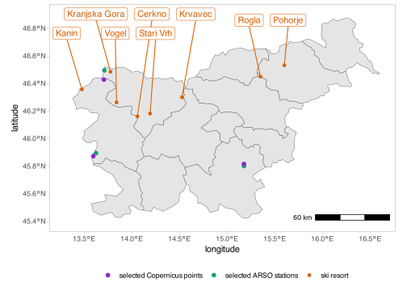
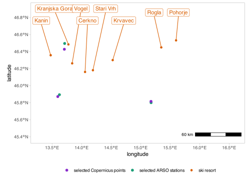
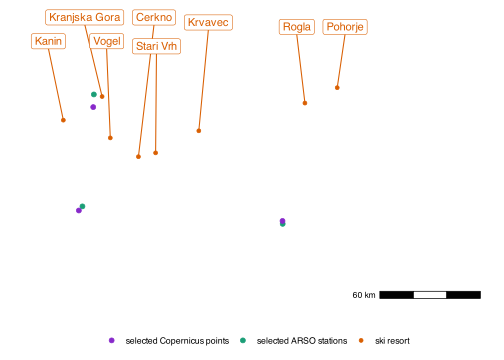

Map
================

## Importing libraries and data

``` r
source("common.R", local = knitr::knit_global())
```

    ## 
    ## Attaching package: 'dplyr'

    ## The following objects are masked from 'package:stats':
    ## 
    ##     filter, lag

    ## The following objects are masked from 'package:base':
    ## 
    ##     intersect, setdiff, setequal, union

``` r
library(dplyr)
library(readr)
```

    ## 
    ## Attaching package: 'readr'

    ## The following object is masked from 'package:scales':
    ## 
    ##     col_factor

``` r
library(ggplot2)
library(sf)
```

    ## Linking to GEOS 3.11.0, GDAL 3.5.3, PROJ 9.1.0; sf_use_s2() is TRUE

``` r
library(rnaturalearth)
library(ggrepel)
library(ggspatial)
library(magick)
```

    ## Linking to ImageMagick 6.9.12.93
    ## Enabled features: cairo, fontconfig, freetype, heic, lcms, pango, raw, rsvg, webp
    ## Disabled features: fftw, ghostscript, x11

Read data from NUTS-3 geopackage (borders between regions). The file was
downloaded from auxillary files at
[CDS](https://cds.climate.copernicus.eu/cdsapp#!/dataset/sis-tourism-snow-indicators?tab=doc).

``` r
nuts3_mapdata <- st_read("geodata/NUTS3_ID.gpkg")
```

    ## Reading layer `NUTS3_ID' from data source 
    ##   `/Users/rokuk/Documents/Code.nosync/R/slovenian-tourism-climate-impacts/R/geodata/NUTS3_ID.gpkg' 
    ##   using driver `GPKG'
    ## Simple feature collection with 1524 features and 8 fields
    ## Geometry type: MULTIPOLYGON
    ## Dimension:     XY
    ## Bounding box:  xmin: -7030022 ymin: -2438080 xmax: 6215534 ymax: 11462690
    ## Projected CRS: WGS 84 / Pseudo-Mercator

Select Slovenian NUTS-3 regions and get ther ids:

``` r
slovenia_nuts3_mapdata <- filter(nuts3_mapdata, cntr_code=="SI")
slovenia_nuts3_ids <- pull(slovenia_nuts3_mapdata, fid)
slovenia_nuts3_names <- pull(slovenia_nuts3_mapdata, nuts_name)
print(slovenia_nuts3_ids)
```

    ##  [1] "SI038" "SI034" "SI035" "SI033" "SI036" "SI037" "SI041" "SI042" "SI043"
    ## [10] "SI044" "SI032" "SI031"

Read one file to get the model’s grid:

``` r
netcdfdata <- readcdf("../data/CIT/RCP4.5/mean/C3S422Lot2TEC_day-fair-cit-month-proj_mean_monthly_2021_2040_v1.nc", "day-fair-cit-month-proj")
grid <- transform_coords(netcdfdata)
```

``` r
names <- c("Rateče", "Bilje", "Novo mesto")
gridpoint_indexes <- c(706, 661, 1060) # these values should be the same as in the file common.R

chosen_gridpoints <- data.frame(
    lon = grid %>% filter(grid$id %in% gridpoint_indexes & grid$month == "jan") %>% pull(lon),
    lat = grid %>% filter(grid$id %in% gridpoint_indexes & grid$month == "jan") %>% pull(lat)
)

print(chosen_gridpoints)
```

    ##        lon      lat
    ## 1 13.59662 45.87349
    ## 2 13.70789 46.42899
    ## 3 15.17597 45.81731

Import coordinates of the stations we are interested in:

``` r
stationcoords <- read.csv("../data/stations.csv")
stationcoords <- stationcoords[c(8,12,14),]
print(stationcoords)
```

    ##       station      lat      lon
    ## 8      Rateče 46.49694 13.71278
    ## 12      Bilje 45.89556 13.62444
    ## 14 Novo mesto 45.80180 15.17730

``` r
skidata <- read_csv("../data/skiresorts.csv", show_col_types = F) %>%
    mutate(region_name=gsub("Å¡","š", slovenia_nuts3_names[match(nuts3id, slovenia_nuts3_ids)]))
skidata$label <- "ski"
print.data.frame(skidata)
```

    ##      ski_resort      lat      lon lowest highest nuts3id region_name label
    ## 1        Cerkno 46.16251 14.05852    800    1300   SI042   Gorenjska   ski
    ## 2         Kanin 46.35882 13.47624   1100    2300   SI043     Goriška   ski
    ## 3 Kranjska Gora 46.48576 13.77673    800    1300   SI042   Gorenjska   ski
    ## 4       Krvavec 46.30159 14.52695   1500    2000   SI042   Gorenjska   ski
    ## 5       Pohorje 46.53328 15.60030    300    1300   SI032   Podravska   ski
    ## 6         Rogla 46.45059 15.34987   1000    1500   SI032   Podravska   ski
    ## 7     Stari Vrh 46.18306 14.19184    500    1200   SI042   Gorenjska   ski
    ## 8         Vogel 46.26346 13.84031    500    1800   SI042   Gorenjska   ski

Read macro tourism regions

``` r
image <- image_read("../data/macro-regions.jpg")
```

## Plots

``` r
p <- ggplot() +
    geom_sf(data=slovenia_nuts3_mapdata) +
    geom_point(data=stationcoords, mapping = aes(lon, lat, color="stations"), size=2) +
    geom_point(data=chosen_gridpoints, mapping = aes(lon, lat, color="selectedgrid"), size=2) +
    geom_point(data=skidata, mapping=aes(lon, lat, color="ski")) +
    geom_label_repel(data=skidata, mapping=aes(lon, lat, label=ski_resort), min.segment.length = 0.3, box.padding = 0.3, color="#d95f02", nudge_y = 46.86-skidata$lat, force=1) +
    scale_color_manual(name="",
                       breaks = c("selectedgrid", "stations", "ski"), values = c(selectedgrid = "#8729Ca", stations = "#1b9e77", ski = "#d95f02"), labels = c("selected Copernicus points", "selected ARSO stations", "ski resort")) +
    coord_sf(xlim=c(13.3, 16.6), ylim=c(45.4, 46.9), crs=4326) +
    xlab("longitude") +
    ylab("latitude") +
    annotation_scale(location="br", pad_y = unit(0.5, "cm")) +
    theme_light() +
    theme(legend.position="bottom", panel.grid.major = element_blank(), panel.grid.minor = element_blank(),
         panel.background = element_rect(fill='transparent'),
         plot.background = element_rect(fill='transparent', color=NA),
         legend.background = element_rect(fill='transparent'))
print(p)
```

<!-- -->

``` r
p <- ggplot() +
    geom_point(data=stationcoords, mapping = aes(lon, lat, color="stations"), size=2) +
    geom_point(data=chosen_gridpoints, mapping = aes(lon, lat, color="selectedgrid"), size=2) +
    geom_point(data=skidata, mapping=aes(lon, lat, color="ski")) +
    geom_label_repel(data=skidata, mapping=aes(lon, lat, label=ski_resort), min.segment.length = 0.3, box.padding = 0.3, color="#d95f02", nudge_y = 46.86-skidata$lat, force=1) +
    scale_color_manual(name="",
                       breaks = c("selectedgrid", "stations", "ski"), values = c(selectedgrid = "#8729Ca", stations = "#1b9e77", ski = "#d95f02"), labels = c("selected Copernicus points", "selected ARSO stations", "ski resort")) +
    coord_sf(xlim=c(13.3, 16.6), ylim=c(45.4, 46.9), crs=4326) +
    xlab("longitude") +
    ylab("latitude") +
    annotation_scale(location="br", pad_y = unit(0.5, "cm")) +
    theme_light() +
    theme(legend.position="bottom", panel.grid.major = element_blank(), panel.grid.minor = element_blank(),
         panel.background = element_rect(fill='transparent'),
         plot.background = element_rect(fill='transparent', color=NA),
         legend.background = element_rect(fill='transparent'))
print(p)
```

<!-- -->

``` r
ggsave("map-paper2.pdf", p, width=6, height=4.5, units="in", path="../output/pdf/maps", device=cairo_pdf)
ggsave("map-paper2.eps", p, width=6, height=4.5, units="in", path="../output/eps/maps", device=cairo_ps)
ggsave("map-paper2.svg", p, width=6, height=4.5, units="in", path="../output/svg/maps")
ggsave("map-paper2.png", p, width=6, height=4.5, units="in", path="../output/png/maps", dpi=500, bg='transparent')
```

``` r
p <- ggplot() +
    geom_point(data=stationcoords, mapping = aes(lon, lat, color="stations"), size=2) +
    geom_point(data=chosen_gridpoints, mapping = aes(lon, lat, color="selectedgrid"), size=2) +
    geom_point(data=skidata, mapping=aes(lon, lat, color="ski")) +
    geom_label_repel(data=skidata, mapping=aes(lon, lat, label=ski_resort), min.segment.length = 0.3, box.padding = 0.3, color="#d95f02", nudge_y = 46.86-skidata$lat, force=1) +
    scale_color_manual(name="",
                       breaks = c("selectedgrid", "stations", "ski"), values = c(selectedgrid = "#8729Ca", stations = "#1b9e77", ski = "#d95f02"), labels = c("selected Copernicus points", "selected ARSO stations", "ski resort")) +
    coord_sf(xlim=c(13.3, 16.6), ylim=c(45.4, 46.9), crs=4326) +
    annotation_scale(location="br", pad_y = unit(0.5, "cm")) +
    theme_light() +
    theme(legend.position="bottom", panel.grid.major = element_blank(), panel.grid.minor = element_blank(),
         panel.background = element_rect(fill='transparent'),
         plot.background = element_rect(fill='transparent', color=NA),
         legend.background = element_rect(fill='transparent'),
         axis.text.x=element_blank(),
         axis.text.y=element_blank(),
         axis.title.x=element_blank(),
         axis.title.y=element_blank(),
         axis.ticks.x=element_blank(),
         axis.ticks.y=element_blank(),
         panel.border = element_blank())
print(p)
```

<!-- -->

``` r
ggsave("map-paper2-nl.pdf", p, width=6, height=4.5, units="in", path="../output/pdf/maps", device=cairo_pdf)
ggsave("map-paper2-nl.eps", p, width=6, height=4.5, units="in", path="../output/eps/maps", device=cairo_ps)
ggsave("map-paper2-nl.svg", p, width=6, height=4.5, units="in", path="../output/svg/maps")
ggsave("map-paper2-nl.png", p, width=6, height=4.5, units="in", path="../output/png/maps", dpi=500, bg='transparent')
```
